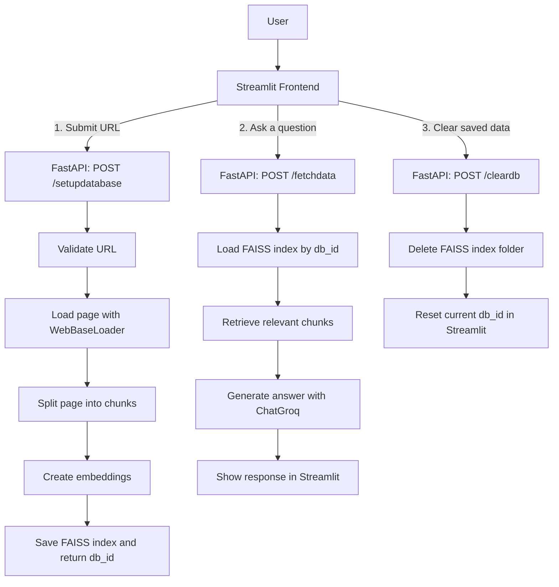

# Web RAG QA Application

**Project Owner:** Sapan

A web retrieval-augmented generation application that indexes the contents of a user-provided URL into a local FAISS vector store and answers questions about that page through a FastAPI backend and Streamlit frontend.

Used AI coding assistants for implementation support.

**Live Demo:** [webragqaapp.redglacier-fbd11a89.canadacentral.azurecontainerapps.io](https://webragqaapp.redglacier-fbd11a89.canadacentral.azurecontainerapps.io)
> Available daily from 8 AM to 5 PM Eastern Time (EST) to optimize resource usage and reduce
> hosting costs. Outside these hours, the service may be unavailable.

## Tech Stack

Python 3.10 · LangChain · Groq (`ChatGroq`) · Hugging Face Sentence Transformers · FAISS · FastAPI · Streamlit · Docker · Supervisor · GitHub Actions CI/CD · Azure Container Registry & Azure Container Apps

## Key Features

- **URL-to-vector-store pipeline** that validates a submitted URL, loads the page with LangChain's `WebBaseLoader`, splits the content into chunks, embeds those chunks, and saves a FAISS index on disk.
- **Question answering over indexed content** using retrieval from the saved FAISS database and a Groq-backed chat model configured as `openai/gpt-oss-20b`.
- **Simple Streamlit workflow** for submitting a URL, asking follow-up questions against the generated index, and clearing the stored database.
- **Per-database local persistence** under `app/backend/faiss_dbs`, with each generated vector store identified by a UUID.
- **Protected backend routes** using `x-api-key` header validation and per-endpoint rate limiting via `slowapi`.
- **Containerized deployment setup** with Docker and Supervisor to run FastAPI and Streamlit together, plus a GitHub Actions workflow that builds in Azure Container Registry and updates an Azure Container App.
- **Structured error logging** through a custom exception wrapper and application logger.

## Architecture



## API Endpoints

All endpoints require an `x-api-key` header and are rate-limited to `5/minute`.

| Method | Endpoint | Purpose |
|---|---|---|
| POST | `/isvalidurl` | Validates that the submitted URL has a supported HTTP or HTTPS shape |
| POST | `/setupdatabase` | Loads the page, creates embeddings, and stores a FAISS database for that URL |
| POST | `/fetchdata` | Retrieves relevant chunks from the stored FAISS database and returns an answer to the submitted query |
| POST | `/cleardb` | Deletes a previously created FAISS database by its identifier |

## Steps to Run Locally

1. Clone the repo and create a Python 3.10 virtual environment.
2. Activate the environment and install the app: `pip install -e .`
3. Create a `.env` file in the project root with at least:
    ```dotenv
    GROQ_API_KEY="<your-groq-api-key>"
    API_KEY="<any-string-used-as-your-api-key>"
    API_BASE_URL="http://localhost:9999"
    ```
4. Run the app: `python -m app.main`
5. Frontend opens at `http://localhost:8501`; backend runs at `http://localhost:9999`.

Alternatively, run each service in its own terminal:

```bash
uvicorn app.backend.web_rag_api:app --host localhost --port 9999
streamlit run app/frontend/index.py
```

## Containerized Run

The repository includes a [Dockerfile](Dockerfile) that installs the package, pre-downloads the `sentence-transformers/all-MiniLM-L6-v2` model, exposes ports `8501` and `9999`, and starts both services through [supervisord.conf](supervisord.conf).

## Known Limitations / Areas for Improvement

- **No distributed tracing or external observability stack** — the repository configures basic local logging only and does not include OpenTelemetry, Application Insights, or similar tracing instrumentation.
- **Single container for frontend and backend** — FastAPI and Streamlit run together in one container through Supervisor. Splitting them would allow independent scaling and cleaner failure isolation.
- **No automated test suite** — the repository does not include unit or integration tests for the ingestion flow, retrieval behavior, API contract, or frontend interactions.
- **No durable application state beyond local files** — FAISS indexes are stored on the local filesystem under `app/backend/faiss_dbs`, while the active `db_id` and latest response only live in Streamlit session state.
- **Single-page ingestion per request** — the ingestion path loads only the submitted URL and does not implement broader site crawling or multi-page indexing.
- **Synchronous indexing on request** — the user waits for page loading, chunking, embedding, and FAISS creation to finish before asking questions.
- **No content moderation on user input or retrieved content** — the user's query and retrieved page chunks are passed directly into the RAG prompt with no profanity, toxicity, or prompt-injection filtering. Acceptable for a portfolio demo, but a real deployment would need an input safety layer.

## Third-Party Components

This project uses the Hugging Face model [`sentence-transformers/all-MiniLM-L6-v2`](https://huggingface.co/sentence-transformers/all-MiniLM-L6-v2), which is licensed under Apache-2.0.

The repository also depends on third-party Python libraries and services listed in the project configuration files. These components are subject to their own licenses and terms.

## License

© 2026 Sarora09. Built for personal learning and as a portfolio project.

This repository includes third-party software and models subject to their own licenses. See `THIRD_PARTY_NOTICES.md` and the respective project/model pages for additional details.